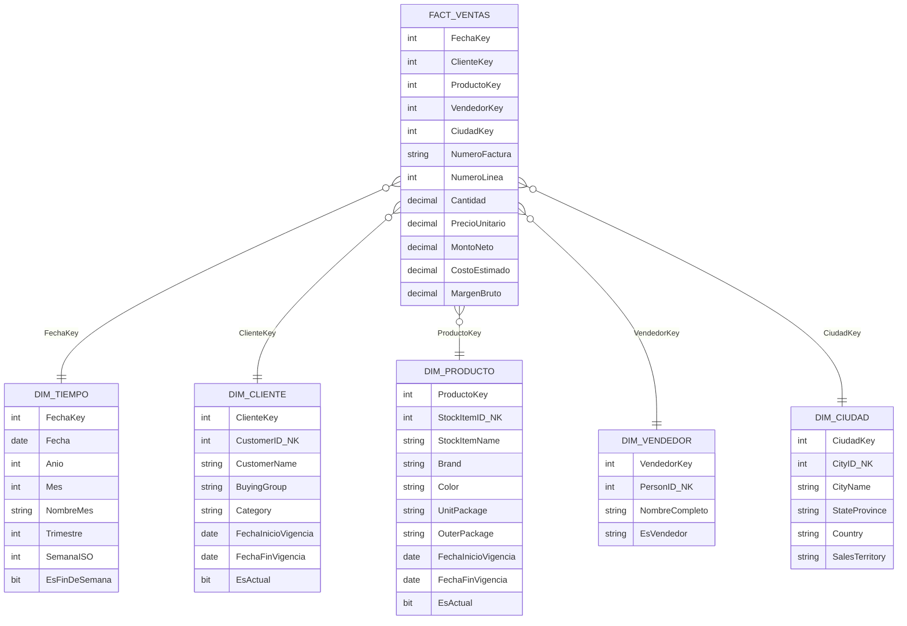

# Unidad IV · Kimball Fase 02
## Modelado Dimensional (caso WideWorldImporters)

> Base de practica: SQL Server - WideWorldImporters

---

## Objetivo de la fase

Transformar los requerimientos de negocio en un esquema dimensional claro: tabla de hechos al centro y dimensiones alrededor.

---

## Flujo de diseno Kimball (4 pasos)


---

## 1. Proceso elegido para la unidad

- Proceso: ventas facturadas.
- Grano: una linea de factura.
- Centro analitico: comportamiento comercial y margen.

---

## 2. Esquema estrella propuesto



---

## 3. Mapeo logico WWI -> DWH

| DWH | WWI fuente | Comentario |
|---|---|---|
| FACT_VENTAS | Sales.InvoiceLines + Sales.Invoices | Linea de factura + fecha |
| DIM_CLIENTE | Sales.Customers | Puede requerir SCD2 |
| DIM_PRODUCTO | Warehouse.StockItems | Puede requerir SCD2 |
| DIM_VENDEDOR | Application.People | Filtrar personal comercial |
| DIM_CIUDAD | Application.Cities + StateProvinces + Countries | Jerarquia geografica |
| DIM_TIEMPO | Generada | Calendario propio del DWH |

---

## 4. Definicion de hechos

Hechos recomendados:

- Cantidad
- PrecioUnitario
- MontoBruto
- Descuento
- MontoNeto
- CostoEstimado
- MargenBruto

Clasificacion didactica:

- Aditivos: Cantidad, MontoNeto, MargenBruto.
- No aditivos: PrecioUnitario (promedio, no suma).

---

## 5. Ejemplo de consulta analitica (T-SQL)

```sql
SELECT
    t.Anio,
    t.Mes,
    p.StockItemName,
    SUM(f.MontoNeto) AS VentasNetas,
    SUM(f.MargenBruto) AS Margen
FROM dbo.FACT_VENTAS f
JOIN dbo.DIM_TIEMPO t ON f.FechaKey = t.FechaKey
JOIN dbo.DIM_PRODUCTO p ON f.ProductoKey = p.ProductoKey
GROUP BY t.Anio, t.Mes, p.StockItemName
ORDER BY t.Anio, t.Mes, VentasNetas DESC;
```

---

## 6. Regla de oro para clase

Si una consulta de negocio habitual necesita mas de 5 JOINs para responderse, revisar el modelo dimensional: probablemente hay sobre-normalizacion.

---

## Criterio de salida de fase

- Esquema estrella validado por negocio.
- Definicion de hechos y dimensiones cerrada.
- Diccionario de columnas minimo por tabla.
