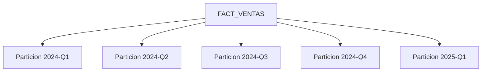

# Unidad IV · Kimball Fase 03
## Diseno Fisico en SQL Server (caso WideWorldImporters)

---

## Objetivo de la fase

Llevar el modelo logico a un modelo fisico eficiente para carga ETL y consultas analiticas.

---

## 1. Decisiones fisicas principales

- Tipo de claves en dimensiones: surrogate keys enteras IDENTITY.
- Particion de hechos: por fecha (mensual o trimestral).
- Indices: clustered en surrogate key de dimensiones; en fact segun patron de consulta.
- Compresion: PAGE o COLUMNSTORE segun volumen.

---

## 2. DDL sugerido para dimensiones (T-SQL)

```sql
CREATE TABLE dbo.DIM_TIEMPO (
    FechaKey        int         NOT NULL PRIMARY KEY,
    Fecha           date        NOT NULL,
    Anio            smallint    NOT NULL,
    Mes             tinyint     NOT NULL,
    NombreMes       varchar(15) NOT NULL,
    Trimestre       tinyint     NOT NULL,
    SemanaISO       tinyint     NOT NULL,
    EsFinDeSemana   bit         NOT NULL
);

CREATE TABLE dbo.DIM_CLIENTE (
    ClienteKey          int IDENTITY(1,1) NOT NULL PRIMARY KEY,
    CustomerID_NK       int               NOT NULL,
    CustomerName        nvarchar(100)     NOT NULL,
    BuyingGroup         nvarchar(50)      NULL,
    Category            nvarchar(50)      NULL,
    FechaInicioVigencia date              NOT NULL,
    FechaFinVigencia    date              NULL,
    EsActual            bit               NOT NULL
);
```

---

## 3. DDL sugerido para fact table

```sql
CREATE TABLE dbo.FACT_VENTAS (
    FactVentaKey     bigint IDENTITY(1,1) NOT NULL,
    FechaKey         int                  NOT NULL,
    ClienteKey       int                  NOT NULL,
    ProductoKey      int                  NOT NULL,
    VendedorKey      int                  NOT NULL,
    CiudadKey        int                  NOT NULL,
    NumeroFactura    nvarchar(20)         NOT NULL,
    NumeroLinea      int                  NOT NULL,
    Cantidad         decimal(18,4)        NOT NULL,
    PrecioUnitario   decimal(18,4)        NOT NULL,
    MontoNeto        decimal(18,2)        NOT NULL,
    CostoEstimado    decimal(18,2)        NULL,
    MargenBruto      decimal(18,2)        NULL,
    CONSTRAINT PK_FACT_VENTAS PRIMARY KEY CLUSTERED (FactVentaKey)
);

ALTER TABLE dbo.FACT_VENTAS
ADD CONSTRAINT FK_FACT_VENTAS_TIEMPO FOREIGN KEY (FechaKey) REFERENCES dbo.DIM_TIEMPO(FechaKey);
```

---

## 4. Rendimiento en SQL Server

Escenario de clase:

- Volumen bajo/medio: usar nonclustered indexes por claves de filtrado frecuentes.
- Volumen alto: usar clustered columnstore index en FACT_VENTAS.

```sql
CREATE NONCLUSTERED INDEX IX_FACT_VENTAS_FechaKey ON dbo.FACT_VENTAS(FechaKey);
CREATE NONCLUSTERED INDEX IX_FACT_VENTAS_ClienteKey ON dbo.FACT_VENTAS(ClienteKey);
CREATE NONCLUSTERED INDEX IX_FACT_VENTAS_ProductoKey ON dbo.FACT_VENTAS(ProductoKey);

-- Para volumenes grandes de analitica:
-- CREATE CLUSTERED COLUMNSTORE INDEX CCI_FACT_VENTAS ON dbo.FACT_VENTAS;
```

---

## 5. Particion recomendada (conceptual)



Ventaja didactica: permite explicar partition pruning y mantenimiento historico.

---

## 6. Checklist de cierre de fase

```text
[ ] Todas las tablas creadas en esquema DWH
[ ] PK/FK definidas
[ ] Tipos de datos revisados con negocio
[ ] Indices base creados
[ ] Estrategia de particion documentada
[ ] Prueba de consulta analitica < 5 segundos en dataset de practica
```
