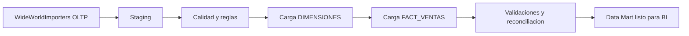

# Unidad IV · Kimball Fase 04
## Diseno ETL para cargar el DWH (WideWorldImporters)

---

## Objetivo de la fase

Disenar y ejecutar el pipeline ETL/ELT que construye dimensiones y hechos con calidad, trazabilidad y control de errores.

---

## 1. Flujo ETL recomendado



---

## 2. Orden de carga

Orden correcto para evitar quiebres de FK:

1. DIM_TIEMPO
2. DIM_CLIENTE
3. DIM_PRODUCTO
4. DIM_VENDEDOR
5. DIM_CIUDAD
6. FACT_VENTAS

---

## 3. Extraccion de fuentes WWI (ejemplo T-SQL)

```sql
-- Vista de staging para lineas facturadas
SELECT
    il.InvoiceLineID,
    il.InvoiceID,
    il.StockItemID,
    il.Quantity,
    il.UnitPrice,
    il.ExtendedPrice,
    i.InvoiceDate,
    i.CustomerID,
    i.SalespersonPersonID
FROM Sales.InvoiceLines il
JOIN Sales.Invoices i
    ON il.InvoiceID = i.InvoiceID;
```

---

## 4. Carga incremental (patron marca de agua)

Tabla de control sugerida:

```sql
CREATE TABLE dbo.ETL_Control (
    Proceso              varchar(100) NOT NULL PRIMARY KEY,
    UltimaFechaProcesada datetime2    NULL,
    UltimoEstado         varchar(20)  NULL,
    FilasProcesadas      int          NULL,
    FechaEjecucion       datetime2    NULL
);
```

Logica:

- Leer UltimaFechaProcesada.
- Extraer solo facturas posteriores.
- Cargar staging.
- Validar reglas.
- Actualizar control al finalizar.

---

## 5. Regla SCD Tipo 2 para clientes (resumen)

Cuando cambian atributos historizables (por ejemplo categoria del cliente):

- Cerrar version actual: EsActual = 0, FechaFinVigencia = fecha_cambio - 1.
- Insertar nueva version: EsActual = 1.
- Mantener CustomerID_NK para trazar continuidad de negocio.

---

## 6. Carga de fact con busqueda de surrogate keys

Principio:

- La fact nunca debe guardar natural keys de OLTP.
- Se resuelven surrogate keys de dimensiones durante el ETL.

Pseudo-secuencia:

```text
1) Leer fila de staging
2) Resolver FechaKey por InvoiceDate
3) Resolver ClienteKey vigente segun CustomerID_NK y fecha
4) Resolver ProductoKey vigente segun StockItemID_NK y fecha
5) Resolver VendedorKey y CiudadKey
6) Insertar fila en FACT_VENTAS
```

---

## 7. Validaciones minimas de calidad

```text
[ ] No hay nulos en claves foraneas de FACT_VENTAS
[ ] MontoNeto >= 0 para ventas normales
[ ] Cantidad > 0
[ ] Reconciliacion: SUM(MontoNeto DWH) ~= SUM(ExtendedPrice WWI)
[ ] Cantidad de lineas cargadas coincide con fuente incremental
```

---

## 8. Manejo de errores didactico

Separar errores tecnicos y errores de datos:

- Error tecnico: timeout, conexion, deadlock.
- Error de dato: CustomerID inexistente, fecha invalida, duplicado de linea.

Recomendacion para clase:

- Crear tabla dbo.ETL_Errores con detalle por lote.
- No abortar todo el lote por 1 fila mala; aplicar cuarentena.

---

## Criterio de salida de fase

- Pipeline ejecuta de inicio a fin.
- Control incremental activo.
- Validaciones documentadas y repetibles.
- Datos listos para explotacion en BI.
