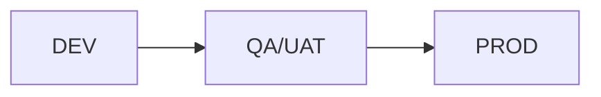

# Unidad IV · Kimball Fase 05
## BI, Publicacion y Despliegue (WideWorldImporters)

---

## Objetivo de la fase

Traducir el Data Mart a indicadores de negocio consumibles por docentes, estudiantes y usuarios funcionales.

---

## 1. Entregables de BI para clase

- Dataset semantico (modelo estrella publicado).
- Dashboard ejecutivo de ventas.
- Dashboard operativo de productos y margenes.
- Diccionario de KPIs.

---

## 2. Propuesta de dashboard ejecutivo

Tarjetas KPI:

- Ventas Netas del periodo.
- Margen Bruto.
- Ticket Promedio.
- Variacion % vs periodo anterior.

Visuales sugeridos:

- Serie temporal mensual.
- Top 10 productos por margen.
- Mapa de ventas por estado/provincia.
- Matriz cliente x categoria.

---

## 3. KPIs base (definicion academica)

| KPI | Formula | Uso |
|---|---|---|
| Ventas Netas | SUM(MontoNeto) | Medir volumen comercial |
| Margen Bruto | SUM(MargenBruto) | Medir rentabilidad |
| Ticket Promedio | SUM(MontoNeto) / COUNT(DISTINCT NumeroFactura) | Eficiencia comercial |
| Margen % | SUM(MargenBruto) / SUM(MontoNeto) | Calidad del ingreso |

---

## 4. SQL de apoyo para validar KPIs

```sql
SELECT
    t.Anio,
    t.Mes,
    SUM(f.MontoNeto) AS VentasNetas,
    SUM(f.MargenBruto) AS MargenBruto,
    CAST(SUM(f.MontoNeto) / NULLIF(COUNT(DISTINCT f.NumeroFactura), 0) AS decimal(18,2)) AS TicketPromedio
FROM dbo.FACT_VENTAS f
JOIN dbo.DIM_TIEMPO t ON t.FechaKey = f.FechaKey
GROUP BY t.Anio, t.Mes
ORDER BY t.Anio, t.Mes;
```

---

## 5. Plan de despliegue por ambientes



Buenas practicas:

- Versionar DDL y ETL.
- Checklist de QA antes de pasar a produccion.
- Definir rollback simple (snapshot + scripts).

---

## 6. QA funcional para clase

```text
[ ] KPI de BI coincide con SQL de control
[ ] Filtros de fecha, cliente y producto funcionan
[ ] Drill-down Anio > Mes > Dia operativo
[ ] Tiempo de respuesta aceptable
[ ] Diccionario de indicadores publicado
```

---

## 7. Cierre didactico de ciclo Kimball

Cuando esta fase termina correctamente, el alumno ve el flujo completo:

- Requisito de negocio -> Modelo dimensional -> ETL -> KPI en dashboard.

Ese recorrido completo es el objetivo formativo principal de la Unidad 4.
