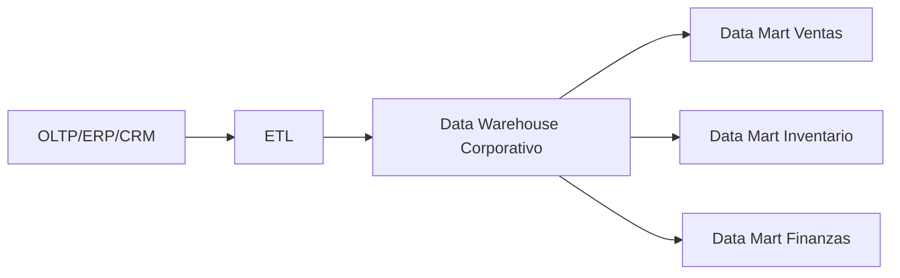
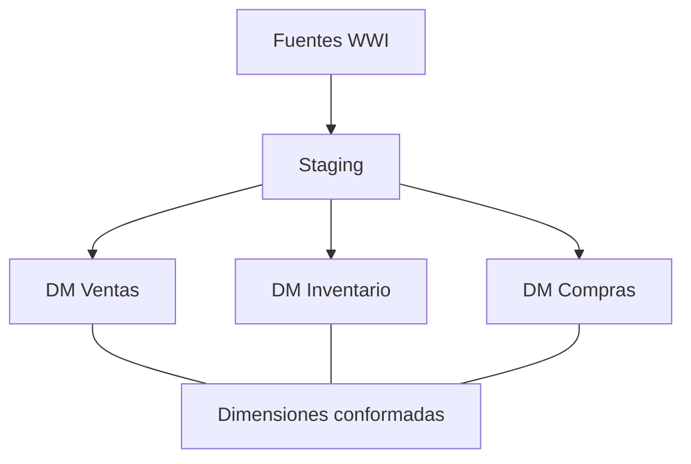

# Unidad IV · Topologias de Data Warehouse
## Guia docente con enfoque Kimball y caso WideWorldImporters

---

## 1. Por que estudiar topologias

La topologia define como viajan y se organizan los datos desde los sistemas operativos hasta el consumo analitico. Elegir bien esta arquitectura evita reprocesos costosos.

---

## 2. Topologia 1: Data Warehouse central + Data Marts

Ventajas:

- Gobierno central fuerte.
- Definiciones unificadas.

Riesgo:

- Mayor tiempo inicial para ver valor.

---

## 3. Topologia 2: Bus Kimball (recomendada para curso)

Ventajas:

- Time-to-value rapido.
- Muy didactica para iteraciones por unidad.

Clave de exito:

- Respetar dimensiones conformadas.

---

## 4. Topologia 3: Lakehouse + capa dimensional

Ventajas:

- Escala y flexibilidad.
- Reuso para analitica avanzada y ciencia de datos.

Riesgo:

- Si no hay gobierno, la capa Gold se degrada en definiciones inconsistentes.

---

## 5. Comparativa rapida

| Criterio | DWH central | Bus Kimball | Lakehouse + Gold |
|---|---|---|---|
| Tiempo al primer resultado | Medio/Alto | Bajo | Medio |
| Curva docente | Media | Baja | Media/Alta |
| Gobierno de datos | Alto | Medio/Alto | Variable |
| Costo operativo | Medio | Medio | Variable |
| Recomendado para Unidad 4 | Si (teorico) | Si (practico principal) | Si (introduccion) |

---

## 6. Aplicacion concreta con WideWorldImporters

Camino sugerido para clase:

1. Construir DM Ventas con bus Kimball.
2. Reusar dim_tiempo, dim_producto, dim_ciudad para DM Inventario.
3. Comparar resultados con la idea de DWH central (nivel conceptual).

---

## Conclusiones didacticas

- Para ensenar modelado, el Bus Kimball es la topologia mas efectiva.
- Para vision arquitectonica, conviene mostrar las 3 topologias y sus trade-offs.
- El criterio de eleccion siempre debe ser negocio + madurez + tiempos.
