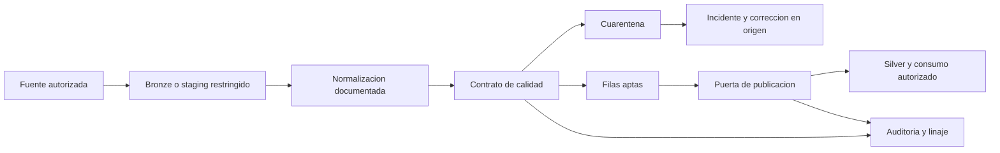

# Manual de gobierno y calidad del dato

## Aplicacion de DAMA y referencias internacionales a un ETL

**Asignatura:** Ingenieria de Datos - Unidad III  
**Version del material:** 1.0 - 2026-10-06  
**Destinatarios:** estudiantes, responsables de negocio, stewards e ingenieros de datos  
**Caso conductor:** ventas ficticias con fallas intencionales, procesadas localmente

Este manual complementa las clases de calidad y gobierno de la Unidad III. Presenta una propuesta de implementacion, no una reproduccion de normas, una certificacion de conformidad ni asesoramiento juridico. Las politicas, plazos y umbrales del caso son ejemplos que una organizacion debe aprobar segun su riesgo, finalidad y obligaciones.

## 1. Recorrido por pasos

1. Comprender las referencias y delimitar el dominio.
2. Asignar autoridad, responsabilidades y decisiones.
3. Inventariar activos, clasificar informacion y acordar definiciones.
4. Convertir necesidades de negocio en contratos de calidad.
5. Incorporar controles y evidencias en cada etapa del ETL.
6. Proteger datos personales, accesos y ciclo de vida.
7. Resolver incidentes, controlar cambios y medir mejoras.
8. Ejecutar los notebooks y revisar sus evidencias.

No conviene comenzar comprando una plataforma de catalogo. Primero se define que decisiones se necesitan, quien las toma y que evidencia prueba su cumplimiento. Un catalogo sin propietarios o definiciones acordadas solo organiza la incertidumbre.

## 2. Referencias: que aporta cada una

| Referencia | Naturaleza y aporte | Aplicacion propuesta | Limite |
| --- | --- | --- | --- |
| DAMA-DMBOK, segunda edicion | Marco de conocimientos y buenas practicas de gestion de datos. | Roles, dominios, calidad, metadatos, seguridad y ciclo de vida. | No es una norma ISO ni un listado obligatorio de herramientas; no certifica este ETL. |
| ISO/IEC 38505-1:2026 | Principios para el gobierno del uso y proteccion de datos, aplicando ISO/IEC 38500. | Responsabilidad de la direccion, decisiones sobre valor/riesgo y supervision. | No prescribe el codigo Python ni los umbrales del ejemplo. Sustituye la edicion 2017. |
| ISO/IEC 25012:2008 | Modelo de calidad de datos estructurados con 15 caracteristicas, inherentes y dependientes del sistema. | Especificar calidad segun uso, ademas de disponibilidad, confidencialidad y trazabilidad. | Las seis dimensiones del curso no son una equivalencia uno a uno con las 15 caracteristicas. |
| Familia ISO 8000 | Estandares de calidad de datos; distintas partes cubren conceptos, medicion, procesos y datos maestros. | Calidad gestionada como proceso, semantica explicita e intercambio controlado. | Debe seleccionarse la parte y edicion aplicable. Mencionar la familia no demuestra conformidad. |
| ISO/IEC 27001:2022 e ISO/IEC 27002 | Sistema de gestion de seguridad y orientacion de controles. | Gestion de riesgos, acceso, registros, respuesta a incidentes y proveedores. | La certificacion del sistema de gestion no garantiza que cada dato sea exacto. Revisar enmiendas y ediciones aplicables. |
| Familia ISO/IEC 11179 | Registros de metadatos y definicion consistente de elementos de datos. | Separar significado, representacion, dominio de valores y responsables. | Un archivo JSON del laboratorio no es un registro conforme a toda la familia. |
| W3C PROV | Familia de documentos para representar procedencia: entidades, actividades y agentes. | Documentar fuente, transformacion, producto y responsable. | Los logs del laboratorio se inspiran en estos conceptos, pero no son una serializacion PROV completa. |
| Legislacion aplicable | Obligaciones legales segun jurisdiccion y contexto. | Finalidad, base juridica, derechos, conservacion y transferencias. | No sustituir el analisis juridico por una etiqueta PII o un hash. |

La ficha oficial de ISO consultada para este material indica que ISO/IEC 38505-1:2026 se publico en agosto de 2026 y sustituyo a 2017. La de ISO/IEC 25012 indica que la edicion 2008 fue confirmada en 2025. Verificar estas fichas antes de adoptar una politica institucional: las referencias cambian y el texto completo de una norma puede requerir acceso licenciado.

### 2.1 DAMA: gobierno y gestion no son sinonimos

**Gobierno** establece derechos de decision y rendicion de cuentas: quien aprueba una definicion, un acceso, un riesgo o una excepcion. **Gestion** ejecuta lo aprobado: documentar, implementar, operar, medir y corregir. El Data Engineer no se convierte en propietario del dato por administrar el servidor.

Las areas de conocimiento del DMBOK abarcan gobierno, arquitectura, modelado/diseno, almacenamiento/operaciones, seguridad, integracion/interoperabilidad, documentos/contenidos, datos maestros/referencia, DW/BI, metadatos y calidad. No son once pasos secuenciales: se coordinan. En un ETL, integracion necesita definiciones de arquitectura, reglas de calidad, permisos de seguridad y metadatos trazables.

Ejemplo: Comercial define que una venta es una linea facturada y que una devolucion no es una venta negativa accidental. El Owner aprueba la definicion y el uso. El Steward mantiene el glosario y las reglas. Ingenieria implementa su validacion. Seguridad controla la identidad de servicio. Auditoria verifica que los controles se ejecutaron.

### 2.2 Calidad, seguridad e integridad

Un dataset puede estar cifrado y contener errores de monto; puede ser exacto y estar expuesto sin autorizacion. La integridad de seguridad se refiere a proteccion frente a alteraciones no autorizadas, mientras que la integridad referencial de calidad verifica relaciones entre registros. Ambas importan, pero no son la misma medida.

## 3. Paso 1 - Definir alcance, valor y riesgo

El dominio del laboratorio es **ventas para analitica comercial**. El producto de datos es una tabla de ventas validas sin contacto personal, con lote, contrato y procedencia identificables. No es un sistema contable, una validacion de identidad real ni una herramienta de marketing.

Antes de implementar, completar una ficha:

| Campo | Pregunta que debe responder |
| --- | --- |
| Identificador y version | Como se identifica sin depender de un nombre ambiguo? |
| Finalidad y consumidores | Para que decision se usa? Quien puede usarlo? |
| Grano y periodo | Que representa una fila? Que fecha o corte aplica? |
| Fuente autorizada | Quien produce el dato? Existe evidencia para comparar exactitud? |
| Owner y Steward | Quien responde por el riesgo y quien opera su gestion? |
| Datos criticos | Que campos afectan un indicador, obligacion o derecho? |
| Sensibilidad | Que datos identifican personas directa o indirectamente? |
| Servicio y conservacion | Cuando debe estar listo y hasta cuando debe conservarse? |
| Limitaciones | Que inferencias no permite o que historia no tiene? |

Priorizar segun impacto por probabilidad. Una clave de venta duplicada puede alterar facturacion y merece un control de publicacion. Un email mal formado puede ser irrelevante para ventas por producto, pero critico para una campana; la finalidad cambia su severidad.

## 4. Paso 2 - Modelo operativo y autoridad

### 4.1 Roles

- **Direccion/comite de datos:** aprueba estrategia, prioridades, politicas transversales y acepta riesgos de alto impacto.
- **Data Owner:** responsable de negocio del dominio; aprueba significado, requisitos, acceso por finalidad y excepciones dentro de su autoridad.
- **Data Steward:** administra definiciones, catalogo, reglas e incidentes; coordina correcciones en origen y presenta evidencias.
- **Data Engineer/custodio tecnico:** implementa controles, permisos tecnicos, ETL, versionado y recuperacion. No cambia el significado del negocio unilateralmente.
- **Seguridad:** evalua amenazas, privilegios, secretos, proteccion y respuesta tecnica a incidentes.
- **Privacidad/legal:** determina aplicabilidad legal, bases juridicas, derechos y transferencias. El rol concreto depende de la organizacion.
- **Consumidor:** utiliza el dato para finalidades autorizadas, comunica problemas y no redistribuye sin permiso.
- **Auditoria:** revisa con independencia evidencias, excepciones y eficacia de controles.

Una persona puede ocupar varios roles en una organizacion pequena, pero deben registrarse los posibles conflictos. En procesos sensibles conviene separar quien solicita acceso, quien lo aprueba y quien lo provisiona.

### 4.2 RACI de ejemplo

R = ejecuta; A = responde por la decision final; C = consultado; I = informado. Se asigna un solo A por actividad en esta plantilla.

| Actividad | Comite | Owner | Steward | Ingenieria | Seguridad/privacidad |
| --- | --- | --- | --- | --- | --- |
| Aprobar politica transversal | A | C | R | C | C |
| Aprobar definicion de venta | I | A | R | C | I |
| Aprobar regla y umbral de calidad | I | A | R | C | C |
| Implementar y probar contrato | I | A | C | R | C |
| Aprobar acceso por finalidad | I | A | R | I | C |
| Provisionar acceso tecnico | I | A | C | R | C |
| Gestionar incidente de calidad | I | A | R | R | C |
| Aprobar plazo de conservacion | I | A | R | C | C |
| Aceptar riesgo transversal alto | A | R | C | C | C |

La RACI es una propuesta interna, no una tabla exigida textualmente por DAMA. Debe coexistir con responsabilidades legales que no pueden delegarse mediante una planilla.

### 4.3 Cadencia y evidencias

Cada lote produce resultados de reglas y decision de publicacion. El Steward revisa alertas diariamente; el Owner revisa incidentes, excepciones y servicio semanalmente; el comite revisa riesgos y mejoras mensualmente. Estos plazos son ilustrativos. Toda reunion debe dejar decisiones, responsable, fecha objetivo y evidencia de cierre, no solo una presentacion de porcentajes.

## 5. Paso 3 - Catalogo, diccionario y glosario

**Glosario:** significado de negocio, por ejemplo "importe de la linea en moneda original, no convertido". **Diccionario:** columnas, tipos, nulabilidad, claves, unidades y reglas. **Catalogo:** inventario de activos con ubicacion, propietarios, sensibilidad, calidad y disponibilidad. **Linaje:** relaciones de produccion y transformacion entre activos.

No son cuatro nombres para la misma tabla. El termino "venta neta" puede aparecer en varios activos; cada implementacion debe demostrar que respeta su definicion o declarar una variante.

### 5.1 Plantilla de elemento de datos

```json
{
  "activo": "silver.ventas",
  "columna": "monto_centavos",
  "termino": "Importe de linea en moneda original",
  "tipo": "INTEGER",
  "unidad": "centavos de la moneda de la fila",
  "nullable": false,
  "reglas": ["DQ_MONTO_POSITIVO"],
  "owner": "Gerencia Comercial",
  "steward": "Steward Comercial",
  "clasificacion": "confidencial",
  "contrato_version": "1.0.0"
}
```

Un monto no es comparable sin moneda. La suma de ARS y USD no es un total economico util. Una conversion necesita fuente, fecha, tipo de cambio y politica de redondeo aprobados; los ejemplos agrupan por moneda y no inventan conversiones.

### 5.2 Cambios de esquema

Agregar una columna opcional puede ser compatible; renombrar una clave, cambiar su significado o volver obligatorio un campo rompe consumidores. Registrar propuesta, impacto por linaje, pruebas, version, aprobacion y fecha efectiva. Durante una migracion, mantener la version anterior el plazo acordado y medir uso antes de retirarla.

## 6. Paso 4 - Calidad del dato sin indicadores enganosos

### 6.1 Dimensiones del curso y ampliacion

| Dimension | Evidencia razonable | Error a evitar |
| --- | --- | --- |
| Completitud | Valores requeridos presentes, contando tambien blancos. | Asumir que todo NULL es incorrecto o que un espacio es informacion. |
| Exactitud | Comparacion con evidencia independiente y fechada sobre campos verificables. | Llamar exactitud a cumplir una regex o tener monto positivo. |
| Consistencia | Reglas entre atributos o representaciones compatibles. | Confundir moneda normalizada con monto economicamente correcto. |
| Unicidad | Clave acorde al grano; distinguir filas conflictivas de duplicados excedentes. | Eliminar por nombre dos personas diferentes o conservar una version al azar. |
| Vigencia/oportunidad | Edad respecto del momento de necesidad, con reloj y zona horaria definidos. | Tratar una compra antigua legitima como un dato obsoleto solo por su fecha de evento. |
| Integridad | FK existente y dominio de valores autorizado. | Un join interno que elimina silenciosamente referencias inexistentes. |

La validez de formato/dominio se mide explicitamente como control complementario. La calidad suele expresarse con distintas taxonomias; este manual conserva las seis dimensiones del curso sin atribuir esa lista como taxonomia unica y universal de DAMA. ISO/IEC 25012 incluye un modelo mas amplio de 15 caracteristicas: exactitud, completitud, consistencia, credibilidad, actualidad, accesibilidad, conformidad, confidencialidad, eficiencia, precision, trazabilidad, comprensibilidad, disponibilidad, portabilidad y recuperabilidad. Las traducciones son orientativas; consultar el texto oficial para un uso normativo.

### 6.2 Definir denominadores

Para cada regla registrar poblacion elegible, observaciones evaluadas, fallas y no evaluables. Un dataset vacio no tiene automaticamente 100% de calidad: si se esperaban registros, la ausencia es un fallo de disponibilidad/completitud del lote. Una comparacion de exactitud sin referencia queda **no evaluable**, no aprobada.

$$
cumplimiento = 100 \times \frac{evaluados - fallidos}{evaluados}
$$

Si el denominador es cero, la metrica es no evaluable. En unicidad pueden usarse dos indicadores diferentes: claves distintas entre filas con clave presente y porcentaje de filas no involucradas en conflictos. El laboratorio usa el segundo para cuarentena: marca todas las filas con la misma clave, no solo las copias excedentes.

Un registro puede fallar tres reglas pero seguir siendo un solo registro rechazado. Por eso la suma de fallos por regla no debe confundirse con el volumen de cuarentena. Tambien es necesario mostrar cobertura: comparar 2 importes correctos de 100 no prueba 100% de exactitud del dataset.

### 6.3 Contrato de calidad

Un contrato une requisitos de esquema, significado, controles, propietarios, severidades y accion. No es solo un conjunto de aserciones sin contexto. Cada regla debe tener:

- ID estable, version y descripcion verificable.
- Activo/campo y dimension de calidad.
- Poblacion, denominador, manejo de NULL y criterio de exito.
- Umbral y fundamento de negocio.
- Severidad y accion: bloquear lote, poner fila en cuarentena o advertir.
- Owner, Steward, implementacion, evidencia y fecha de revision.

Ejemplo: `DQ_FK_PRODUCTO` exige producto existente para toda venta. Fila invalida va a cuarentena y no a Silver. `DQ_EMAIL_FORMATO` advierte en analitica de ventas porque email no es necesario; en marketing seria un contrato diferente. Una alerta IQR indica revision, no autorizacion para borrar importes grandes.

### 6.4 Puerta de publicacion del caso

La politica del laboratorio permite cargar solo filas validas si la fraccion rechazada no supera 20%, hay al menos una fila aceptada y se reconcilian cantidades e importes aceptados. Esta tolerancia es didactica. Un lote con mayor rechazo se bloquea, aunque el promedio de reglas sea alto. Un campo obligatorio ausente o una columna inesperada bloquea por deriva de esquema hasta revision del contrato.

Las advertencias se registran y se asignan, pero no bloquean por si solas. Una excepcion real debe tener aprobador autorizado, motivo, alcance, controles compensatorios, fecha de expiracion y plan de correccion; no consiste en bajar el umbral hasta que el lote pase.

## 7. Paso 5 - Gobierno dentro del ETL



### 7.1 Extraccion

Usar una identidad de servicio con lectura limitada al origen autorizado. Parametrizar filtros, registrar rango extraido y checkpoint. Preservar evidencia del lote con acceso restringido y conservacion aprobada. Un archivo Bronze no debe permanecer indefinidamente "porque podria servir".

Registrar hash SHA-256 del contenido permite detectar que el contenido cambia; **no prueba autenticidad ni protege de un atacante que modifica archivo y hash**. Para ello hacen falta controles adicionales como almacenamiento inmutable, firma/verificacion, permisos y un registro protegido.

### 7.2 Transformacion

Separar normalizaciones autorizadas de correcciones inferidas. Quitar espacios y convertir `ars` a `ARS` no autoriza a inventar un DNI, imputar un precio o borrar una devolucion legitima. Conservar origen y regla aplicada. En el caso se parsean fechas ISO con formato explicito y se convierte dinero con `Decimal` a centavos enteros, evitando errores de coma flotante.

No deduplicar por orden de llegada sin una politica de version o evento. Ante dos registros con igual ID y contenido conflictivo, el caso pone ambos en cuarentena. En produccion, la resolucion puede usar secuencia fuente o fecha de modificacion si existe garantia suficiente y aprobacion del Owner.

### 7.3 Validacion y cuarentena

Cada fila tiene un identificador tecnico de origen independiente de la clave de negocio, para poder rastrear incluso una fila sin ID. Guardar motivos por fila y resultados por regla. La cuarentena debe tener responsable, finalidad, permisos, retencion y flujo de reintento. No exponer datos personales en reportes de fallos de calidad ni en alertas por email.

### 7.4 Carga transaccional e idempotencia

Publicar datos y control de lote coherentemente. Si hay fallo tecnico, no avanzar checkpoint ni dejar mitad del lote visible. La clave unica en destino evita duplicados y la comparacion de contenido detecta conflictos: `INSERT OR IGNORE` no debe ocultar un importe cambiado para una misma venta.

El laboratorio usa SQLite en memoria para probar FK, atomicidad, conflicto y recarga sin administrar un servidor. Es una demostracion de patrones, no una plataforma de gobierno de produccion. Un control Python de roles no sustituye los permisos del motor, y SQLite no ofrece por si solo RBAC corporativo ni cifrado de almacenamiento.

### 7.5 Reconciliacion

Para un lote inicial:

$$
filas\_origen = filas\_aceptadas + filas\_rechazadas
$$

Para una recarga, las aceptadas se dividen en nuevas y ya existentes iguales. Comparar importes aceptados por moneda y por el conjunto de claves del lote, no por el total historico del DW. Reconciliar bruto, rechazado y aceptado sin sumar monedas diferentes. Si una cantidad no puede parsearse, registrarla como no evaluable, no como cero.

### 7.6 Linaje util

Registrar tanto linaje de activo/campo como evidencia de ejecucion. El conteo "100 entraron, 90 salieron" no explica de donde vino `monto_centavos`. Se necesitan fuente, campo, expresion, regla, version de codigo, contrato, hash de lote y destino. W3C PROV distingue la entidad producida, la actividad que la produjo y el agente responsable; el laboratorio representa esas relaciones en un JSON de ejemplo.

## 8. Paso 6 - Politicas de proteccion y ciclo de vida

### 8.1 Clasificacion

| Nivel propuesto | Ejemplo | Controles minimos del diseno |
| --- | --- | --- |
| Publico | Indicadores expresamente autorizados para difusion. | Aprobacion de publicacion, calidad y riesgo de reidentificacion. |
| Interno | Documentacion operacional sin datos personales. | Autenticacion y acceso por funcion. |
| Confidencial | Ventas a nivel de transaccion y acuerdos comerciales. | Minimo privilegio, trazabilidad de acceso y restricciones de exportacion. |
| Restringido | Identificadores personales, contactos y datos legalmente sensibles. | Finalidad y base juridica verificadas, acceso limitado, cifrado y gestion de incidentes. |

La lista es una politica de ejemplo, no una clasificacion universal DAMA. Dato personal y dato legalmente sensible no son sinonimos. El historial de compras asociado a una persona tambien puede ser dato personal aunque no incluya su nombre.

### 8.2 Acceso

Una solicitud debe incluir solicitante autenticado, activo, finalidad, operaciones, plazo y justificacion. El Owner aprueba el uso y Seguridad/privacidad intervienen segun riesgo. Ingenieria provisiona permisos reales, registra la decision y programa revocacion. Revisar periodicamente permisos efectivos, usuarios inactivos y cuentas de servicio.

Los notebooks simulan roles para mostrar el flujo de decision; no autentican usuarios. En SQL Server, implementar roles con `GRANT SELECT` sobre vistas autorizadas, denegar tablas crudas y gestionar cuentas mediante el sistema de identidad institucional. Probar acceso permitido y denegado con identidades separadas, no solo con una variable de texto en Python.

### 8.3 Minimizacion, masking y seudonimizacion

**Minimizacion:** si el indicador no necesita nombre/email, no cargarlos al producto analitico. **Masking:** oculta parte del dato para una vista concreta; puede seguir identificando. **Seudonimizacion:** sustituye identificadores por tokens y mantiene posibilidad de vinculacion. **Anonimizacion:** exige que la identificacion no sea razonablemente posible en el contexto, considerando informacion auxiliar y ataques; no se demuestra solamente borrando el nombre.

Un hash sin secreto de un email o DNI puede atacarse por enumeracion. El ejemplo usa HMAC-SHA256 con una clave aleatoria efimera y separacion de contexto; no imprime ni persiste la clave. HMAC no cifra ni hace anonimo el dato. Si se requiere vinculacion entre lotes, la clave debe conservarse en un gestor de secretos, con rotacion, identificador de version y control de acceso. Regenerarla en cada ejecucion impide vinculacion estable entre sesiones, deliberadamente en esta demo.

Evitar PII en nombres de archivo, logs, muestras de fallos, excepciones y salidas del notebook. Los ejemplos usan solo datos ficticios y dominios `.invalid`. En entornos reales, revisar tambien outputs guardados en `.ipynb`, exports, caches y archivos temporales.

### 8.4 Conservacion y supresion

Definir plazo por activo y finalidad, incluyendo Bronze, Silver, cuarentena, logs, backups y replicas. La fecha de vencimiento debe ser calculable y su ejecucion auditable. Una retencion por obligacion legal o litigio puede suspender la supresion; debe estar documentada y limitada.

Procedimiento: identificar alcance -> verificar excepciones/obligaciones -> localizar copias por catalogo y linaje -> ejecutar eliminacion autorizada -> propagar a derivados -> gestionar backups segun politica -> verificar -> registrar evidencia sin volver a copiar el dato eliminado. Borrar una fila de una tabla no prueba supresion completa.

### 8.5 Marco legal y limites

En Argentina considerar Ley 25.326, normativa complementaria y criterios de la AAIP. En la UE, el GDPR tiene criterios territoriales del articulo 3: establecimiento y, en determinados casos, oferta de bienes/servicios o monitoreo de personas en la Union. No se resume correctamente como "datos de ciudadanos europeos". El consentimiento no es la unica base juridica posible y la supresion no es absoluta en cualquier contexto.

El Owner debe solicitar analisis juridico sobre finalidad, base de tratamiento, transparencia, derechos, transferencias y obligaciones sectoriales. La ubicacion del servidor o la nacionalidad por si solas no resuelven aplicabilidad. Este material no declara cumplimiento legal de una organizacion.

## 9. Paso 7 - Incidentes y mejora continua

### 9.1 Procedimiento de incidente de calidad

1. Detectar: regla y version, lote, fecha, activo, volumen y alcance afectados.
2. Clasificar: impacto comercial, privacidad, consumidores y severidad.
3. Contener: bloquear publicacion o restringir producto; no borrar evidencia sin politica.
4. Asignar: Owner responsable, Steward coordinador e ingeniero ejecutor.
5. Diagnosticar: revisar cambios de esquema, origen, codigo, referencia o infraestructura.
6. Corregir: preferentemente en origen; registrar cambio autorizado y plan de reejecucion.
7. Validar: correr contrato y reconciliacion, comprobar consumidores y no duplicacion.
8. Cerrar: aprobacion, evidencia, causa raiz, prevencion y revision de metricas.

Un incidente de seguridad o privacidad puede requerir otro canal y plazos regulatorios especificos. No deben asumirse los plazos ilustrativos de calidad como plazos legales.

### 9.2 Plantilla de incidente

```json
{
  "incidente": "DQ-2026-001",
  "activo": "silver.ventas",
  "lote": "lote-identificable",
  "regla": "DQ_UNICIDAD",
  "estado": "abierto",
  "owner": "Gerencia Comercial",
  "steward": "Steward Comercial",
  "impacto": "Posible doble conteo",
  "contencion": "No publicar filas conflictivas",
  "causa_raiz": null,
  "evidencia_cierre": null
}
```

### 9.3 Monitoreo y SLA/SLO

Un SLI es la medida, un SLO su objetivo y un SLA un acuerdo con consecuencias. Ejemplo: latencia del lote es el SLI; publicacion antes de una hora acordada es el SLO. No llamar SLA a cualquier porcentaje escrito en un notebook.

Medir por lote: volumen esperado/recibido, rechazo unico, fallos por regla, referencias no evaluables, latencia, disponibilidad de producto y tiempo de correccion. Medir por dominio: activos con Owner, definiciones aprobadas, cobertura de contratos, accesos revisados, excepciones vencidas y reincidencia. Desagregar por fuente y periodo: una media puede ocultar una region completamente ausente.

Detectar drift comparando distribuciones y volumen con una base representativa. Un cambio estadistico no identifica automaticamente un defecto: puede reflejar estacionalidad o una campana. Steward y negocio investigan antes de corregir. No recalibrar automaticamente umbrales para normalizar un fallo.

### 9.4 Ciclo de mejora

Planificar reglas segun riesgo -> ejecutar -> medir -> revisar causas -> aprobar mejora -> versionar -> probar -> monitorear. La madurez no se mide por la cantidad de reglas, sino por decisiones reproducibles, menos incidentes y uso seguro de productos confiables.

## 10. Matriz de trazabilidad de la propuesta

| Practica del manual | Referencia orientadora | Evidencia del caso | Que faltaria en una implantacion real |
| --- | --- | --- | --- |
| Derechos de decision y RACI | DAMA y ISO/IEC 38505-1 | Owner, Steward y politica identificados. | Mandato institucional y aprobaciones autenticas. |
| Calidad segun uso | DAMA, ISO/IEC 25012, familia ISO 8000 | Reglas, denominadores, rechazo y puerta. | Requisitos aprobados y evaluacion normativa especifica. |
| Definiciones y catalogo | DAMA y familia ISO/IEC 11179 | Diccionario y catalogo JSON. | Repositorio central, workflow y revision periodica. |
| Proteccion | ISO/IEC 27001/27002 y legislacion aplicable | Minimizacion, token y pruebas de vistas. | IAM, RBAC real, cifrado, claves, DLP y revision legal. |
| Procedencia | DAMA y W3C PROV | Campo fuente, transformacion, lote y hash. | Integracion entre sistemas y almacenamiento protegido. |
| Gestion de cambios/incidentes | DAMA y gestion de calidad | Deriva de esquema, bloqueo y reintento. | Tickets, escalamiento, notificaciones y cierre autorizado. |

La matriz no es una declaracion de cumplimiento de clausulas. Para una auditoria normativa se requiere texto autorizado, alcance definido, evaluacion de requisitos y evidencias verificadas por la organizacion.

## 11. Paso 8 - Laboratorio y resultados esperados

Los notebooks se encuentran en `notebook/unidad_III`. Se ejecutan localmente en Python con pandas y modulos de la biblioteca estandar, como `sqlite3`, `json`, `decimal` y `hmac`. No requieren Databricks, Spark, Great Expectations, cuentas cloud, SQL Server ni servicios externos. Jupyter es solo la interfaz para ejecutar las celdas; no cambia el motor de procesamiento.

Cada notebook arranca desde datos ficticios reproducibles y puede ejecutarse sin depender de outputs previos. El modulo compartido conserva exclusivamente los datos, la normalizacion, la evaluacion por fila y sus auxiliares usados por los cinco ejemplos. Las funciones especificas de profiling, publicacion, carga SQLite, metadatos, linaje y privacidad estan definidas en las celdas del notebook correspondiente. El ETL se muestra tanto en el ejemplo de carga como en el de monitoreo para que ambos puedan estudiarse y ejecutarse independientemente. Las dependencias de ejecucion y de Jupyter se indican en el archivo de requisitos de esa carpeta.

La [guia de ejecucion local](../../notebook/unidad_III/README.md) detalla instalacion, seleccion de kernel, orden de trabajo y limites. Ejemplos disponibles:

- [01 - Profiling y dimensiones](../../notebook/unidad_III/01_profiling_y_dimensiones.ipynb).
- [02 - Contrato y reglas](../../notebook/unidad_III/02_contrato_y_reglas_calidad.ipynb).
- [03 - ETL gobernado y cuarentena](../../notebook/unidad_III/03_etl_gobernado_y_cuarentena.ipynb).
- [04 - Metadatos, linaje y privacidad](../../notebook/unidad_III/04_metadatos_linaje_y_privacidad.ipynb).
- [05 - Monitoreo e incidentes](../../notebook/unidad_III/05_monitoreo_e_incidentes.ipynb).

1. **Profiling y dimensiones:** distinguir blancos, fechas invalidas, conflictos de clave, outliers y exactitud con referencia. No limpia silenciosamente datos.
2. **Contrato con Python y pandas:** comparar resultados por regla, separar cuarentena de advertencias y probar que la referencia cubre solo algunos registros. El contrato, las funciones y las aserciones son codigo Python visible, sin un motor de validacion externo.
3. **ETL gobernado:** cargar SQLite con FK, bloquear un lote defectuoso, publicar uno apto, repetirlo y provocar un conflicto para comprobar rollback.
4. **Metadatos, linaje y privacidad:** crear glosario/diccionario/catalogo, producir linaje por campo y vistas segun finalidad, y demostrar limites del token HMAC.
5. **Monitoreo e incidentes:** comparar lotes, detectar deriva de esquema y degradacion, asignar incidentes y validar reintento autorizado sin bajar umbrales.

Los errores esperados se capturan y se explican: una ejecucion correcta del notebook puede demostrar que un lote fue rechazado. No se debe quitar una asercion solo para obtener una salida "verde".

### 11.1 Ejercicios de extension

- Cambiar finalidad de analitica a marketing y justificar nuevas reglas de email.
- Agregar una moneda con aprobacion/version y demostrar que no se mezcla en un total.
- Integrar los CSV de Unidad II sin sobrescribirlos; documentar su contrato y ambiguedades de fechas.
- Sustituir SQLite por SQL Server usando transacciones, roles y parametros; probar acceso real con dos identidades.
- Agregar un control de volumen esperado por sucursal y demostrar un lote vacio o incompleto.
- Definir politica de reintento que no altere Bronze y mantenga vinculacion entre original/correccion.

## 12. Checklist de adopcion

- Dominio, finalidad, grano y fuente autorizada definidos.
- Owner, Steward y custodio designados; autoridad y escalamiento documentados.
- Glosario, diccionario, clasificacion y catalogo aprobados.
- Reglas versionadas con denominadores, severidad y acciones.
- ETL con evidencia fuente, cuarentena, auditoria y carga atomica/idempotente.
- Exactitud diferenciada de validez y cobertura de referencia declarada.
- Vistas de consumo minimizadas y permisos reales probados fuera del laboratorio.
- Retencion, supresion, backups, excepciones e incidentes definidos.
- Monitoreo por fuente/periodo y procedimiento de mejora activo.
- Limitaciones y supuestos comunicados a consumidores.

## 13. Referencias y lecturas

Referencias publicas consultadas el 2026-10-06; no se reproducen contenidos protegidos de normas o libros. Las descripciones y procedimientos anteriores son una sintesis didactica propia.

- [DAMA International y DMBOK](https://www.dama.org/cpages/body-of-knowledge): marco de conocimientos; consultar la edicion disponible y su acceso autorizado.
- [ISO/IEC 38505-1:2026](https://www.iso.org/standard/87195.html): ficha oficial de gobierno del dato.
- [ISO/IEC 25012:2008](https://www.iso.org/standard/35736.html): ficha oficial del modelo de calidad.
- [Catalogo ISO](https://www.iso.org/standards.html): localizar partes aplicables de ISO 8000, ISO/IEC 11179 e ISO/IEC 27002 y comprobar ediciones.
- [ISO/IEC 27001](https://www.iso.org/isoiec-27001-information-security.html): seguridad de la informacion, incluyendo enmiendas indicadas en la ficha.
- [W3C PROV Overview](https://www.w3.org/TR/prov-overview/): mapa de recomendaciones y notas de procedencia.
- [GDPR, texto oficial en EUR-Lex](https://eur-lex.europa.eu/eli/reg/2016/679/oj): revisar especialmente alcance territorial y bases de tratamiento. El enlace se incluye para consulta legal; no se verifico el texto completo con la herramienta de lectura de esta sesion.
- [AAIP](https://www.argentina.gob.ar/aaip/datospersonales): autoridad argentina y orientacion sobre proteccion de datos personales.
- [Biblioteca estandar de Python](https://docs.python.org/3/library/): SQLite, JSON, Decimal y HMAC utilizados en el laboratorio local.
